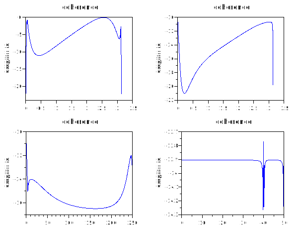
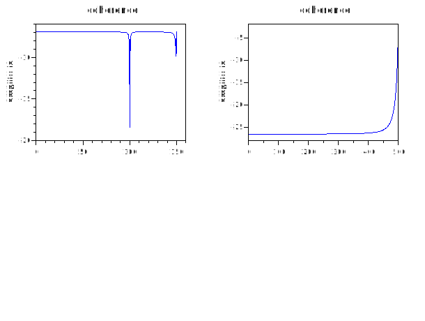

# cohere
## Description
Estimate (mean square) coherence of signals "x" and "y".
Use the Welch (1967) periodogram/FFT method.
Compatible with Matlab R11 cohere and earlier.
See "help pwelch" for description of arguments, hints and references — especially hint (7) for Matlab R11 defaults.

## Calling Sequence
- ` [Pxx, freq] = cohere(x,y,Nfft,Fs,window,overlap,range,plot_type,detrend) `

## Dependencies: 
pwelch
## Examples
1. 
```scilab
subplot(2,2,1)
t = linspace(0,10,1000); x = sin(t) ; y = cos(t);
cohere(x,y)
subplot(2,2,2)
cohere(t,x,400)
subplot(2,2,3)
cohere(t,y,300,500)
subplot(2,2,4)
t = linspace(1,10,1000); x =sin(t);
y = filter(0.23,x,t);
cohere(x,y,500,100,6)
```


2.
```scilab
subplot(2,2,1)
t = linspace(1,10,1000); x =cos(t);
y = filter(0.9999,x,t);
cohere(x,y,800,300,7,0.56)
subplot(2,2,2)
t = linspace(1,10,1000); x =filter(0.3245,cos(t),t); y = filter(0.0034,x,sin(t));
cohere(x,y,700,1000,4,0.67,"half")
```

