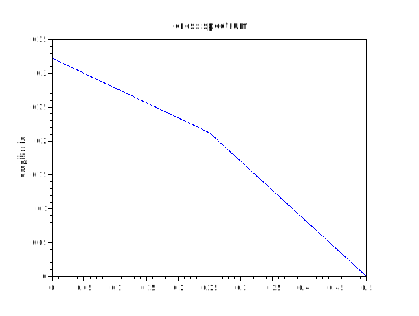
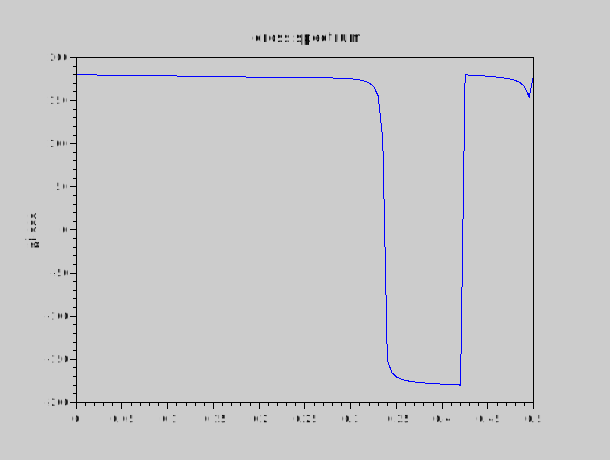

# cpsd
## Description
Estimate cross power spectrum of data x and y by the Welch (1967) periodogram/FFT method.
See "help pwelch" for description of arguments, hints and references 

## Calling Sequence
- `[Pxx, freq] = cpsd (x, y)`
- `[…] = cpsd (x, y, window)`
- `[…] = cpsd (x, y, window, overlap)`
- `[…] = cpsd (x, y, window, overlap, Nfft)`
- `[…] = cpsd (x, y, window, overlap, Nfft, Fs)`
- `[…] = cpsd (x, y, window, overlap, Nfft, Fs, range)`
- `cpsd (…)`
## Dependencies: 
pwelch
## Examples
1. 
```scilab
t = linspace(0,10,1000); x = sin(t) ; y = cos(t);
cpsd(x,y)
```


2.
```scilab
 cpsd(t,x,4)
```




3.
```scilab
cpsd(t,y,7,0.88,12,200,"half")
```


4.
```scilab
t = linspace(1,10,1000); x =cos(t);
y = filter(0.9999,x,t);
cpsd(x,y,8,0.33,200)

```



5
```scilab
t = linspace(1,10,1000); x =filter(0.3245,cos(t),t); y = filter(0.0034,x,sin(t));
cpsd(x,y,7,0.22, 400,1000)
```

