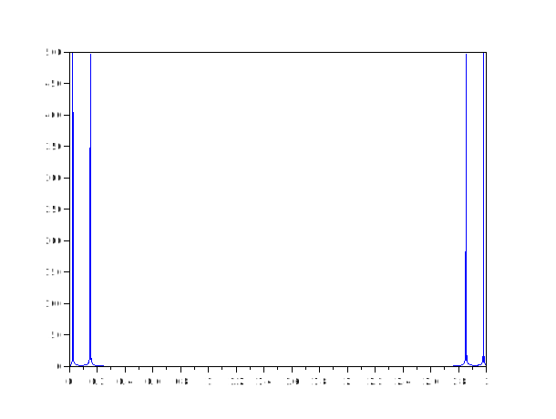

# czt
## Description
Chirp z-transform.

Compute the frequency response starting at a and stepping by w for m steps. a is a point in the complex plane, and w is the ratio between points in each step (i.e., radius increases exponentially, and angle increases linearly).

### Dependencies: 
fft1 ifft1
## Calling Sequence

- `czt(x)`
- `czt(x, m)`
- `czt(x, m, w)`
- `czt(x, m, w, a)`
## Parameters
- `x` : A Matrix or a vector
- `m` : number of steps
- `w` : ratio between points in each step
- `a` : a point in the complex plane
- 
If you don’t specify them, then the parameters default to a Fourier transform: m=length(x), w=exp(-j*2*pi/m), a=1

If x is a matrix, the transform will be performed column-by-column.
## Examples
1. To evaluate the frequency response for the range f1 to f2 in a signal with sampling frequency Fs, use the following:
```scilab
 t=linspace(0,50,1000); 
    f=linspace(0,3,1000);    
    x_t=sin(t) + cos(t*2*%pi);  
    x_f=czt(x_t);   
    plot(f,abs(x_f)); 

```


2.
```scilab
 czt([1 2 4;8 7 5;0 7 3])
```
```output
ans  =

   9. + 0.i          16. + 0.i   12. + 0.i       
  -3. - 6.9282032i  -5.  + 0.i   0.  - 1.7320508i
  -3. + 6.9282032i  -5.  + 0.i   0.  + 1.7320508i
3.
```scilab
czt([ 12 78 54; 87 43 67 ;98 64 56],2)
```
```output
ans=
197.000 -   0.000i   185.000 -   0.000i   177.000 -   0.000i
    23.000 +   0.000i    99.000 +   0.000i    43.000 +   0.000i

```
4.
```scilab
czt([15 26;78 43;90 87;76 43],2,4)
```
```output
ans =

    259.00    199.00
   6631.00   4342.00
```
5.
```scilab
czt([15 34 89;98 54 32],2,4,3)
```
```output
ans =

    2.4375    3.7500    5.0625    3.7500    3.3125    1.8750
    4.7500    6.5000    8.2500    7.5000    6.2500    3.0000
   12.0000   15.0000   18.0000   18.0000   14.0000    6.0000


```
