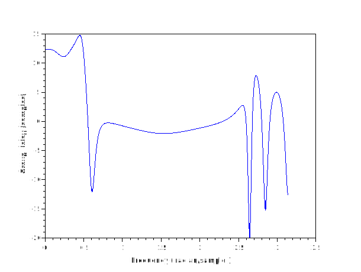

#  grpdelay
## Description
Compute the group delay of a filter.
Group delay, g(w) = -d/dw [arg{H(e^jw)}], is the rate of change of phase with respect to frequency. It can be computed as:

              d/dw H(e^-jw)
       g(w) = -------------
                H(e^-jw)
where

        H(z) = B(z)/A(z) = sum(b_k z^k)/sum(a_k z^k).
By the quotient rule,

                   A(z) d/dw B(z) - B(z) d/dw A(z)
       d/dw H(z) = -------------------------------
                              A(z) A(z)
Substituting into the expression above yields:

               A dB - B dA
       g(w) =  ----------- = dB/B - dA/A
                   A B
Note that,

       d/dw B(e^-jw) = sum(k b_k e^-jwk)
       d/dw A(e^-jw) = sum(k a_k e^-jwk)
which is just the FFT of the coefficients multiplied by a ramp.
## Calling Sequence
- `[g, w] = grpdelay (b) ` : returns the group 
delay g of the FIR filter with coefficients b. The response is 
evaluated at 512 angular frequencies between 0 and pi. w is a vector containing the 512 frequencies. The group delay is in units of samples. It can be converted to seconds by multiplying by the sampling period (or dividing by the sampling rate fs).

- `[g, w] = grpdelay (b, a) ` :  returns the group delay of the rational IIR filter whose numerator has coefficients b and denominator coefficients a.
- `[g, w] = grpdelay (…, n) ` : returns the group delay evaluated at n angular frequencies. For fastest computation n should factor into a small number of small primes.
- `[g, w] = grpdelay (…, n, "whole") ` : evaluates the group delay at n frequencies between 0 and 2*pi.
- `[g, f] = grpdelay (…, n, Fs) ` :  evaluates the group delay at n frequencies between 0 and Fs/2.
- `[g, f] = grpdelay (…, n, "whole", Fs) ` : evaluates the group delay at n frequencies between 0 and Fs.
- `[g, w] = grpdelay (…, w) ` : evaluates the group delay at frequencies w (radians per sample).
- `[g, f] = grpdelay (…, f, Fs) ` :  evaluates the group delay at frequencies f (in Hz).


grpdelay(...) plots the group delay vs. frequency.

If the denominator of the computation becomes too small, the group delay is set to zero. (The group delay approaches infinity when there are poles or zeros very close to the unit circle in the z plane.)
## Parameters
- `b` : Coefficients of the numerator polynomial of the filter (FIR or IIR).

- `a` : (optional): Coefficients of the denominator polynomial of the filter (only for IIR filters).

- `n` : (optional): Number of angular frequencies at which to evaluate the group delay. For efficient computation, n should be a product of small primes.

- `"whole"` : (optional): Specifies frequency range. If specified:

    "whole": Frequencies range from 0 to 2π radians per sample.
- `Fs` : (numeric value): Frequencies range from 0 to Fs Hz or Fs radians per sample.
- `w` : (optional): Vector of specific frequencies (in radians per sample) at which to evaluate the group delay.

- `f` : (optional): Vector of specific frequencies (in Hz) at which to evaluate the group delay.

- `Fs` : (optional): Sampling rate in Hz. Used to specify the frequency range when f or "whole" is specified.

### Dependencies: 
fft1 
## Examples
1. 
```scilab
   [gd1,w] = grpdelay([0,1]);
   [gd2,w] = grpdelay([0,1],1);
   and( gd1 == gd2 ) // any( gd1 == gd2 ) in octave
```
```output
ans  =

  T

```

2.
```scilab
 [gd,w] = grpdelay([0,1],1,4);
 gd , w
```
```output

gd  = 

   1.
   1.
   1.
   1.
  w  = 

   0.
   0.7853982
   1.5707963
   2.3561945  
```
3.
```scilab
[gd,w] = grpdelay([0,1],1,4,'whole');
gd,w

```
```output
  gd  = 

   1.
   1.
   1.
   1.

-->w
 w  = 

   0.
   1.5707963
   3.1415927
   4.7123890
```
4.
```scilab
gd= grpdelay(1,[1,.9],[0,0.125,0.25,0.375],1);

```
```output

gd  = 

  -0.4736842
  -0.4691838
  -0.4475138
  -0.3231597
```
5.
```scilab

 DR= [1.00000 -0.00000 -3.37219 0.00000 ...
      5.45710 -0.00000 -5.24394 0.00000 ...
      3.12049 -0.00000 -1.08770 0.00000 0.17404];
 N = [-0.0139469 -0.0222376 0.0178631 0.0451737 ...
       0.0013962 -0.0259712 0.0016338 0.0165189 ...
       0.0115098 0.0095051 0.0043874];
  grpdelay(N,DR,1024);     
```



