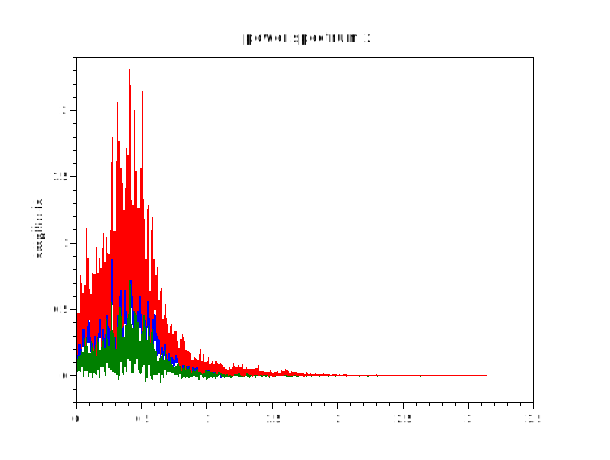
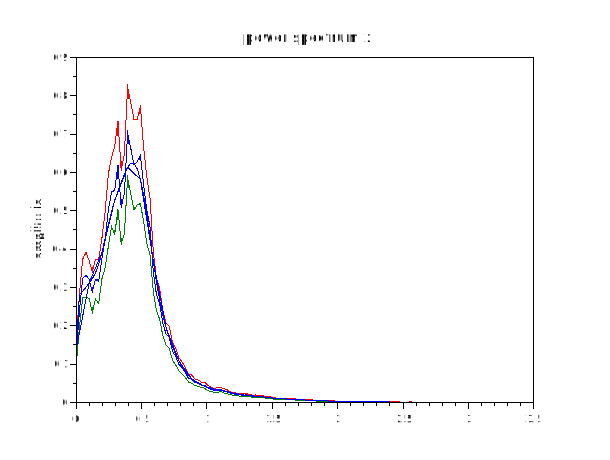

# hilbert
## Dependencies
fft1 ifft1 ipermute
## Calling Sequence  and  Parameters

- `   h = hilbert (f) `  
- `   h = hilbert (f, N) `
- `   h = hilbert (f, N, dim) `
## Description
Analytic extension of real valued signal.
h = hilbert (f) computes the extension of the real valued signal f to an analytic signal. If f is a matrix, the transformation is applied to each column.

 For N-D arrays, the transformation is applied to the first non-singleton dimension.

real (h) contains the original signal f. imag (h) contains the Hilbert transform of f.

hilbert (f, N) does the same using a length N Hilbert transform. The result will also have length N.

hilbert (f, [], dim) or hilbert (f, N, dim) does the same along dimension dim.
## Examples
1. 
```scilab
// notice that the imaginary signal is phase-shifted 90 degrees
t=linspace(0,10,256);
z = hilbert(sin(2*%pi*0.5*t));
plot(t,real(z),t,imag(z));

```


2.
```scilab
 //the magnitude of the hilbert transform eliminates the carrier
 t=linspace(0,10,1024);
 x=5*cos(0.2*t).*sin(100*t);
plot(t,x,t,abs(hilbert(x)));
```


3.
```scilab
t=linspace(0,100,10000);
x = cos (t) + sin(t);
plot(t(1:5000),x(1:5000),t(1:5000),abs(hilbert(x,5000)))

```


4.
```scilab
t=linspace(0,100,100000);
x = cos(t).*sin(t);
plot(t,x,t,abs(hilbert(x)))
```


5.
```Scilab
t=linspace(0,100,100000);
// all together in a 2d array
x = [sin(t);cos(t);sin(t).*cos(t)];
y = hilbert(x,[],2);
subplot(2,2,1)
plot(t,x(1,:),t,abs(y(1,:)))
subplot(2,2,2)
plot(t,x(2,:),t,abs(y(2,:)))
subplot(2,2,3)
plot(t,x(3,:),t,abs(y(3,:)))
```

