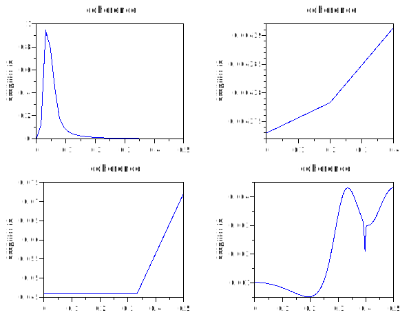
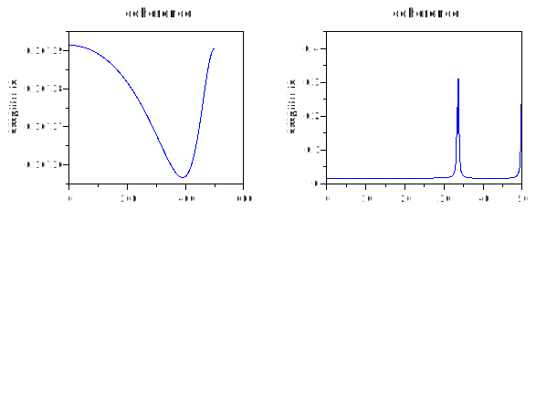

# mscohere
## Description
Estimate (mean square) coherence of signals x and y. Use the Welch (1967) periodogram/FFT method.

## Calling Sequence
- `[Pxx, freq] = mscohere (x, y)` 
- `[…] = mscohere (x, y, window)`
- `[…] = mscohere (x, y, window, overlap)` 
- `[…] = mscohere (x, y, window, overlap, Nfft)`
- `[…] = mscohere (x, y, window, overlap, Nfft, Fs)`
- `[…] = mscohere (x, y, window, overlap, Nfft, Fs, range)` 
- `mscohere (…)`

## Parameters
See "help pwelch" for description of arguments, hints and references
### Dependencies: 
 pwlech
## Examples
1. 
```scilab
t = linspace(0,10,1000); x = sin(t) ; y = cos(t);
subplot(2,2,1)
mscohere(x,y)
subplot(2,2,2)
mscohere(t,x,5)
subplot(2,2,3)
mscohere(t,y,6,0.45)
subplot(2,2,4)
t = linspace(1,10,1000); x =sin(t);
y = filter(0.23,x,t);
mscohere(x,y,7,0.70,300)
```


2.
```scilab
subplot(2,2,1)
t = linspace(1,10,1000); x =cos(t);
y = filter(0.9999,x,t);
mscohere(x,y,5,0.32,212,1000)
subplot(2,2,2)
t = linspace(1,10,1000); x =filter(0.3245,cos(t),t); y = filter(0.0034,x,sin(t));
mscohere(x,y,8,0.49,300,100,"onesided")
```


