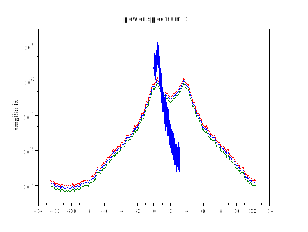
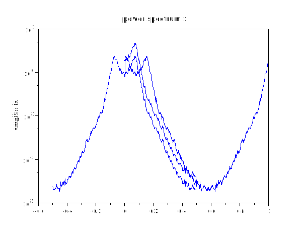
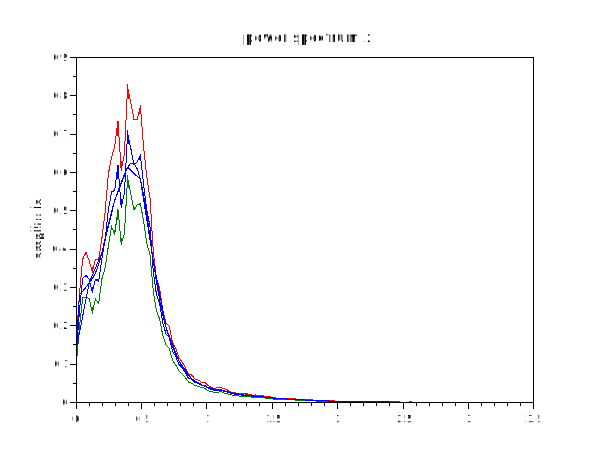

# Pwelch

## Dependencies
fft1
## Description 
Estimate power spectral density of data "x" by the Welch (1967) periodogram/FFT method.
All arguments except "x" are optional.
## Calling Sequence 
 - `[spectra,freq]= pwelch (x, y, window, overlap, Nfft, Fs, range,plot_type, detrend, sloppy, results)`

The data is divided into segments. If "window" is a vector, each segment has the same length as "window" and is multiplied by "window" before (optional) zero-padding and calculation of its periodogram.

If "window" is a scalar, each segment has a length of "window" and a Hamming window is used.
The spectral density is the mean of the periodograms, scaled so that area under the spectrum is the same as the mean square of the data.

This equivalence is supposed to be exact, but in practice there is a mismatch of up to 0.5% when comparing area under a periodogram with the mean square of the data.


- `[spectra,Pxx_ci,freq] = pwelch (x, window, overlap, Nfft, Fs, conf, range ,plot_type ,detrend, sloppy)`

Two-channel spectrum analyser. Estimate power spectral density, cross- spectral density, transfer function and/or coherence functions of time- series input data "x" and output data "y" by the Welch (1967) periodogram/FFT method.

pwelch treats the second argument as "y" if there is a control-string argument "cross", "trans", "coher" or "ypower"; "power" does not force the 2nd argument to be treated as "y". All other arguments are optional. All spectra are returned in matrix "spectra".

- `[spectra,Pxx_ci,freq] = pwelch (x, y, window, overlap, Nfft, Fs,conf, range, plot_type, detrend, sloppy, results)`

Estimates confidence intervals for the spectral density.
See Hint (7) below for compatibility options.

Confidence level "conf" is the 6th or 7th numeric argument. If "results" control-string arguments are used, one of them must be "power" when the "conf" argument is present; pwelch can estimate confidence intervals only for the power spectrum of the "x" data. It does not know how to estimate confidence intervals of the cross-power spectrum, transfer function or coherence; if you can suggest a good method, please send a bug report.
## ARGUMENTS
All but the first argument are optional and may be empty, except that the "results" argument may require the second argument to be "y".
- `x `: [non-empty vector] system-input time-series data
- `y` : [non-empty vector] system-output time-series data
- `window` : [real vector] of window-function values between 0 and 1; the data segment has the same length as the window. Default window shape is Hamming. if (integer scalar() length of each data segment.

The default value is window=sqrt(length(x)) rounded up to the nearest integer power of 2; see ’sloppy’ argument.`
- `overlap`: [real scalar] segment overlap expressed as a multiple of window or segment length. 0 <= overlap < 1, The default is overlap=0.5 .
- `Nfft` : [integer scalar] Length of FFT. The default is the length of the "window" vector or has the same value as the scalar "window" argument. If Nfft is larger than the segment length, "seg_len", the data segment is padded with "Nfft-seg_len" zeros. The default is no padding. Nfft values smaller than the length of the data segment (or window) are ignored silently.
- `Fs` : [real scalar] sampling frequency (Hertz); default=1.0

- `conf` : [real scalar] confidence level between 0 and 1. Confidence intervals of the spectral density are estimated from scatter in the periodograms and are returned as Pxx_ci. Pxx_ci(:,1) is the lower bound of the confidence interval and Pxx_ci(:,2) is the upper bound. 

If there are three return values, or conf is an empty matrix, confidence intervals are calculated for conf=0.95 . If conf is zero or is not given, confidence intervals are not calculated. Confidence intervals can be obtained only for the power spectral density of x; nothing else.

### CONTROL-STRING ARGUMENTS 
Each of these arguments is a character string. Control-string arguments must be after the other arguments but can be in any order.

- `range `:
’half’, ’onesided’ :

frequency range of the spectrum is zero up to but not including Fs/2. Power from negative frequencies is added to the positive side of the spectrum, but not at zero or Nyquist (Fs/2) frequencies. This keeps power equal in time and spectral domains. See reference [2].

’whole’, ’twosided’ :

 frequency range of the spectrum is -Fs/2 to Fs/2, with negative frequencies stored in "wrap around" order after the positive frequencies; e.g. frequencies for a 10-point ’twosided’ spectrum are 0 0.1 0.2 0.3 0.4 0.5 -0.4 -0.3 -0.2 -0.1

’shift’, ’centerdc’ :

 same as ’whole’ but with the first half of the spectrum swapped with second half to put the zero-frequency value in the middle. (See "help fftshift".

 If data (x and y) are real, the default range is ’half’, otherwise default range is ’whole’.

- `plot_type` :
’plot’, ’semilogx’, ’semilogy’, ’loglog’, ’squared’ or ’db’: 

specifies the type of plot. The default is ’plot’, which means linear-linear axes. ’squared’ is the same as ’plot’. ’dB’ plots "10*log10(psd)". This argument is ignored and a spectrum is not plotted if the caller requires a returned value.

- `detrend`
 ’no-strip’, ’none’ – do NOT remove mean value from the data

’short’, ’mean’ – remove the mean value of each segment from each segment of the data.

’linear’, – remove linear trend from each segment of the data.

’long-mean’ – remove the mean value from the data before splitting it into segments. This is the default.

- `sloppy`

’sloppy’:   FFT length is rounded up to the nearest integer power of 2 by zero padding. FFT length is adjusted after addition of padding by explicit Nfft argument. The default is to use exactly the FFT and window/ segment lengths specified in argument list.

- `results` : specifies what results to return (in the order specified and as many as desired).

’power’ calculate power spectral density of "x"

’cross’ calculate cross spectral density of "x" and "y"

’trans’ calculate transfer function of a system with input "x" and output "y"

’coher’ calculate coherence function of "x" and "y"

’ypower’ calculate power spectral density of "y"

The default is ’power’, with argument "y" omitted.

## RETURNED VALUES:

If return values are not required by the caller, the results are plotted and nothing is returned.
- `spectra` : [real-or-complex matrix] columns of the matrix contain results in the same order as specified by "results" arguments. 
Each column contains one of the result vectors.
- `Pxx_ci` : [real matrix] estimate of confidence interval for power spectral density of x. First column is the lower bound. 
Second column is the upper bound.
- `freq`: [real column vector] frequency values
# HINTS
### EMPTY ARGS: 

if you don’t want to use an optional argument you can leave it empty by writing its value as [].

### FOR BEGINNERS:

The profusion of arguments may make pwelch difficult to use, and an unskilled user can easily produce a meaningless result or can easily mis-interpret the result.

With real data "x" and sampling frequency "Fs", the easiest and best way for a beginner to use pwelch is probably "pwelch(x,[],[],[],Fs)".

Use the "window" argument to control the length of the spectrum vector. For real data and integer scalar M, "pwelch(x,2*M,[],[],Fs)" gives an M+1 point spectrum. 
Run "help pwelch".


### WINDOWING FUNCTIONS:

Without a window function, sharp spectral peaks can have strong sidelobes because the FFT of a data in a segment is in effect convolved with a rectangular window. 
                            
A window function which tapers off (gradually) at the ends produces much weaker sidelobes in the FFT. Hann (hanning), hamming, bartlett, blackman, flattopwin etc are available as separate Matlab/sigproc or Octave functions. 

The sidelobes of the Hann window have a roll-off rate of 60dB/decade of frequency. The first sidelobe of the Hamming window is suppressed and is about 12dB lower than the first Hann sidelobe, but the roll-off rate is only 20dB/decade. You can inspect the FFT of a Hann window by plotting "abs(fft(postpad(hanning(256),4096,0)))". The default window is Hamming.


### ZERO PADDING:

Zero-padding reduces the frequency step in the spectrum, and produces an artificially smoothed spectrum. 

For example, "Nfft=2*length(window)" gives twice as many frequency values, but adjacent PSD (power spectral density) values are not independent; adjacent PSD values are independent if "Nfft=length(window)", which is the default value of Nfft.


### REMOVING MEAN FROM SIGNAL: 

If the mean is not removed from the signal there is a large spectral peak at zero frequency and the sidelobes of this peak are likely to swamp the rest of the spectrum. 

For this reason, the default behavior is to remove the mean. However, the matlab pwelch does not do this.

### WARNING ON CONFIDENCE INTERVALS :
                            
Confidence intervals are obtained by measuring the sample variance of the periodograms and assuming that the periodograms have a Gaussian probability distribution. 

This assumption is not accurate. If, for example, the data (x) is Gaussian, the periodogram has a Rayleigh distribution. 
 However, the confidence intervals may still be useful.

### COMPATIBILITY WITH Matlab R11, R12, etc
                            
When used without the second data (y) argument, 
arguments are compatible with the pwelch of Matlab R12, R13, R14, 2006a and 2006b except that
        
1) overlap is expressed as a multiple of window length — effect of overlap scales with window length

2) default values of length(window), Nfft and Fs are more sensible, and

3) Goertzel algorithm is not available so Nfft cannot be an array of frequencies as in Matlab 2006b.

Pwelch has four persistent Matlab-compatibility levels. Calling pwelch with an empty first argument sets the order of arguments and defaults specified above in the USAGE and ARGUMENTS section of this documentation.

```box
prev_compat=pwelch([]);
[Pxx,f]=pwelch(x,window,overlap,Nfft,Fs,conf,...);
```


Calling pwelch with a single string argument (as described below) gives compatibility with Matlab R11 or R12, or the R14 spectrum.welch defaults. The returned value is the PREVIOUS compatibility string.

#### Matlab R11: 
For compatibility with the Matlab R11 pwelch:
```
prev_compat=pwelch('R11-');
[Pxx,f]=pwelch(x,Nfft,Fs,wioverlap,conf,range,units);
// units of overlap are "numbesamples"
// defaults: Nfft=min(lengt256), Fs=2*pi, length(window)=Nfft,
//           window=Hanning, dodetrend,
// N.B.  "Sloppy" is not available.
```
#### Matlab R12: 
For compatibility with Matlab R12 to 2006a pwelch:
```
prev_compat=pwelch('R12+');
[Pxx,f]=pwelch(x,window,ovnfft,Fs,...);
// units of overlap are "numbsamples"
// defaults: length(window)==(x)/8, window=Hamming,
//           Nfft=maNextPow2), Fs=2*pi, do not detrend
// NextPow2 is the next powergreater than or equal to the
// window length. "Sloppy", "are not available.  Default
// window length gives veryamplitude resolution.
```
To adopt defaults of the Matlab R14 "spectrum.welch" spectrum object associated "psd" method.
```
prev_compat=pwelch('psd');
[Pxx,f] = pwelch(x,window,ovNfft,Fs,conf,...);
// overlap is expressedpercentage of window length,
// defaults: length(window)Nfft=max(256,NextPow2), Fs=2*pi
//           do not detrend
// NextPow2 is the next powergreater than or equal to the
// window length. "Sloppy" iavailable.
// Default window length coarse frequency resolution.
```
        */
-
## Examples
1. Demo 1
```scilab
   pi = %pi ; i = %i;
   Fs = 25;
   a = [ 1.0 -1.6216505 1.1102795 -0.4621741 0.2075552 -0.018756746 ];
   white = rand(1,16384);
   signal = detrend(filter(0.70181,a,white));
   skewed = signal.*exp(2*pi*i*2/25*[1:16384]);
   compat = pwelch ([]); 
   pwelch(skewed,[],[],[],Fs,'shift','semilogy');
   pwelch(skewed,[],[],[],Fs,0.95,'shift','semilogy');
   pwelch('R12+');
   pwelch(signal,'squared');
   pwelch (compat);
```




2. Demo 2
```scilab
 a = [ 1.0 -1.6216505 1.1102795 -0.4621741 0.2075552 -0.018756746 ];
 white = rand(1,16384);
 signal = detrend(filter(0.70181,a,white));
 skewed = signal.*exp(2*pi*i*2/25*[1:16384]);
 compat = pwelch ([]);
 pwelch(signal);
 pwelch(skewed);
 pwelch(signal,'shift','semilogy');
 pwelch (compat);
```


3. Demo 3
```scilab
 a = [ 1.0 -1.6216505 1.1102795 -0.4621741 0.2075552 -0.018756746 ];
 white = rand(1,16384);
 signal = detrend(filter(0.70181,a,white));
 compat = pwelch ([]);
 pwelch(signal,3640,[],4096,2*pi,[],'no-strip');
 pwelch (compat);  
```


4. Demo 4
```scilab
 a = [ 1.0 -1.6216505 1.1102795 -0.4621741 0.2075552 -0.018756746 ];
 white = rand(1,16384);
 signal = detrend(filter(0.70181,a,white));
 compat = pwelch ([]);
 pwelch(signal,[],[],[],2*pi,0.95,'no-strip');
 pwelch(signal,64,[],[],2*pi,'no-strip');
 pwelch(signal,64,[],256,2*pi,'no-strip');
 pwelch (compat);

```


5. Demo 5
```scilab
5. a = [ 1.0 -1.6216505 1.1102795 -0.4621741 0.2075552 -0.018756746 ];
 white = rand(1,16384);
 signal = detrend(filter(0.70181,a,white));
 compat = pwelch ('psd');
 pwelch(signal,'squared');
 pwelch({});
 pwelch(white,signal,'trans','coher','short')
 pwelch (compat);
 ```


