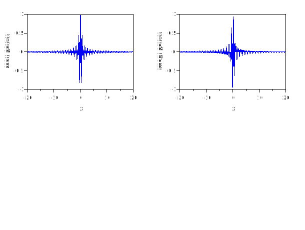
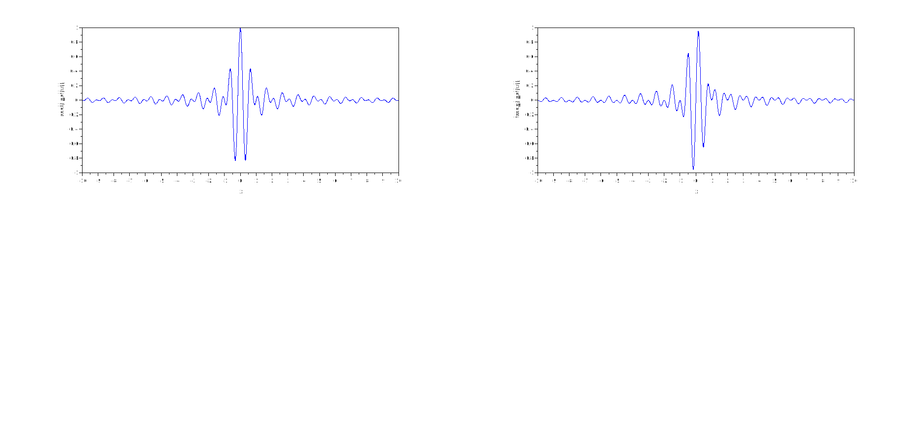
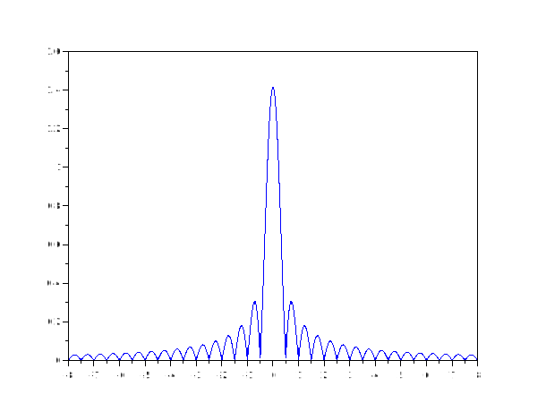
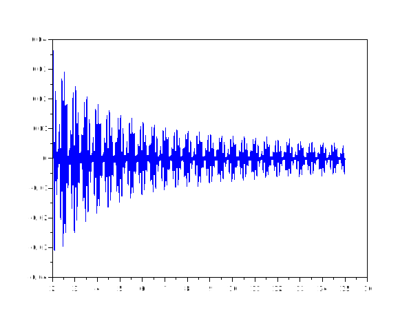
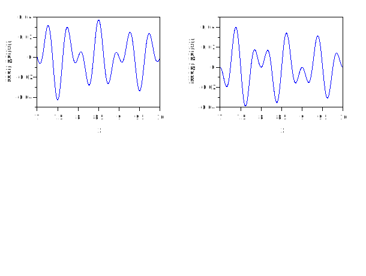

# shanwavf
## Description
Compute the Complex Shannon wavelet.

The complex Shannon wavelet is defined by a bandwidth parameter fb, a wavelet center frequency fc, and the expression

# $\psi(x) = f b^{\frac{1}{2}} \text{sinc}(fb \cdot x) e^{2\pi i f c x}$


on an n-point regular grid in the interval of lb to ub.

## Calling Sequence

- `[psi, x]= shanwavf(lb, ub, n, fb, fc)`
## Input  Parameters

- `lb, ub (Real valued scalers)` : Interval endpoints lb ≤ ub, specified as a pair of real-valued scalars.

- `n (Real valued integer strictly positive)` : Number of regularly spaced points in the interval [lb,ub], specified as a positive integer.


- `fb`	
Time-decay parameter of the wavelet (bandwidth in the frequency domain). Must be a positive scalar.

- `fc`	
Center frequency of the complex Shannon wavelet, specified as a positive scalar.

## Output Parameters
- `psi` : Complex Shannon wavelet evaluated on the n point regular grid x in the interval [lb,ub], returned as a 1-by-n vector.
- `x`   : Grid where the complex Shannon wavelet is evaluated, returned as a 1-by-n vector. The sample points are evenly distributed between lb and ub.

## Examples
1. 
```scilab
fb= 1
fc = 1.5
lb = -20
ub = 20
n = 1000
[psi,x]=shanwavf(lb,ub,n,fb,fc);
subplot(2,2,1)
plot(x,real(psi))
xlabel("x")
ylabel("real( psi(x))")
subplot(2,2,2)
plot(x,imag(psi))
xlabel("x")
ylabel("imag( psi(x))")

```



2. 
```scilab
fb = 1;
fc = 1.5;
lb = -10; 
ub = 10; 
n = 1000;
[psi,x]=shanwavf(lb,ub,n,fb,fc);
subplot(2,2,1)
plot(x,real(psi))
xlabel("x")
ylabel("real( psi(x))")
subplot(2,2,2)
plot(x,imag(psi))
xlabel("x")
ylabel("imag( psi(x))")

```


3.
```scilab
[psi,x]=shanwavf(-8,8,1000,2,1);
plot(x,abs(psi))
```


4.
```scilab
[psi,x]=shanwavf(2,15,2000,18,1);
plot(x,psi)
```


5.
```scilab
[psi,x]=shanwavf(7,10,2000,1,2);
subplot(2,2,1)
plot(x,real(psi))
xlabel("x")
ylabel("real( psi(x))")
subplot(2,2,2)
plot(x,imag(psi))
xlabel("x")
ylabel("imag( psi(x))")

```

