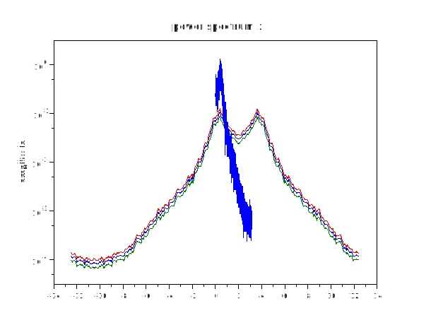
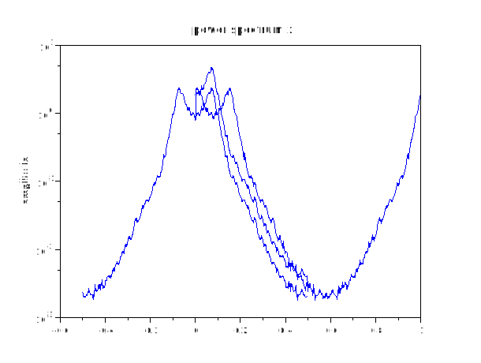
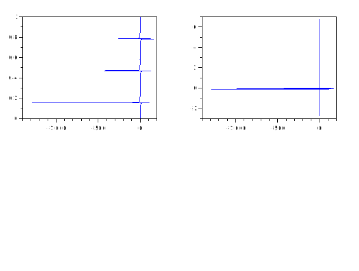

#  spectral_adf
## Description
Return the spectral density estimator given a vector of autocovariances c, window name win, and bandwidth, b.

The window name, e.g., "triangle" or "rectangle" is used to search for a function called win_lw.

If win is omitted, the triangle window is used.

If b is omitted, 1 / sqrt (length (c)) is used.

## Calling Sequence

- ` spectral_adf (c) `
- ` spectral_adf (c, win) `
- ` spectral_adf (c, win, b) `
## Parameters
- `c` : Vector of autocovariances
- `win` : The window name . Default window is "triangle"
- `b` : Bandwidth. Default is 1/sqrt(length(c))

### Dependencies: 
fft1
## Examples
1. 
```scilab
t = linspace(-10,10,2000);
x = sin(2*t) + cos(3*t);
f = 1./t;
y = spectral_adf(x);
subplot(2,2,1)

plot(t,y(:,1))

subplot(2,2,2)

plot(t,y(:,2))

subplot(2,2,3)

plot(f,y(:,1))

subplot(2,2,4)

plot(f,y(:,2))
```


2.
```scilab
 x = [3456:5000];
y = spectral_adf(x);
subplot(2,2,1)

plot(x,y(:,1))

subplot(2,2,2)

plot(x,y(:,2))
```


3.
```scilab
x = [ 87:101];
y = spectral_adf(x,"rectangle")
```
```output
     y  = 

   0.          621.     
   0.0666667   422.51231
   0.1333333   40.537861
   0.2        -148.24109
   0.2666667  -49.884223
   0.3333333   90.      
   0.4         55.241093
   0.4666667  -68.165945
   0.5333333  -68.165945
   0.6         55.241093
   0.6666667   90.      
   0.7333333  -49.884223
   0.8        -148.24109
   0.8666667   40.537861
   0.9333333   422.51231
```
4.
```scilab
x = [16:30];
y = spectral_adf(x,"triangle",2)


```
```output
 y  = 

   0.          16.
   0.0666667   16.
   0.1333333   16.
   0.2         16.
   0.2666667   16.
   0.3333333   16.
   0.4         16.
   0.4666667   16.
   0.5333333   16.
   0.6         16.
   0.6666667   16.
   0.7333333   16.
   0.8         16.
   0.8666667   16.
   0.9333333   16.

```
5.
```scilab

t = linspace(0,10,1000);

x = sin(t).*cos(t)+ tan(t) ;

y = spectral_adf(x);
subplot(2,2,1)

plot(x,y(:,1))

subplot(2,2,2)

plot(x,y(:,2))


```

