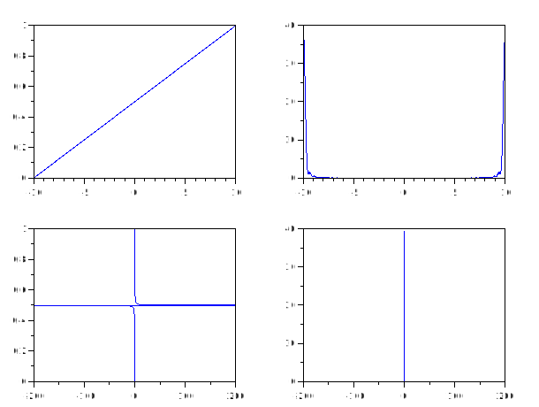
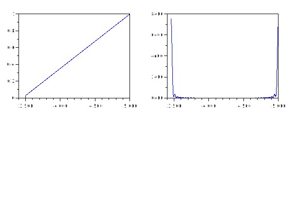
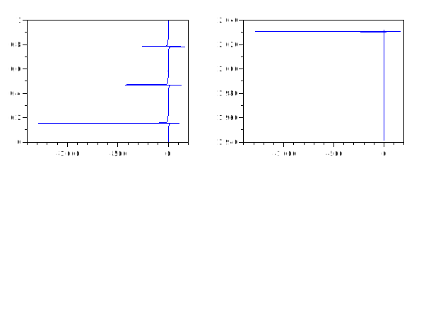

# spectral_xdf
## Description
Return the spectral density estimator given a data vector x, window name win, and bandwidth, b.

The window name, e.g., "triangle" or "rectangle" is used to search for a function called win_sw.

If win is omitted, the triangle window is used.

If b is omitted, 1 / sqrt (length (x)) is used.

## Calling Sequence
- `spectral_xdf (x)`
- `spectral_xdf (x, win)`
- `spectral_xdf (x, win, b)`
## Parameters
- `x` : Data vector
- `win` : the window name . Default "triangle" is used .
-  `b` : Bandwidth . Default value 1/sqrt(length(x))


### Dependencies: 
fft1 ifft1

## Examples
1. 
```scilab
t = linspace(-10,10,2000);
x = sin(2*t) + cos(3*t);
f = 1./t;
y = spectral_xdf(x);
subplot(2,2,1)

plot(t,y(:,1))

subplot(2,2,2)

plot(t,y(:,2))

subplot(2,2,3)

plot(f,y(:,1))

subplot(2,2,4)

plot(f,y(:,2))
```


2.
```scilab
 x = [3456:5000];
y = spectral_xdf(x);
subplot(2,2,1)

plot(x,y(:,1))

subplot(2,2,2)

plot(x,y(:,2))
```


3.
```scilab
x = [ 87:101];
y = spectral_xdf(x,"rectangle")
```
```output
y =

         0   48.0000
    0.0667   48.6751
    0.1333   38.5374
    0.2000   13.5694
    0.2667   -0.5363
    0.3333    6.0000
    0.4000    9.0973
    0.4667    0.6572
    0.5333    0.6572
    0.6000    9.0973
    0.6667    6.0000
    0.7333   -0.5363
    0.8000   13.5694
    0.8667   38.5374
    0.9333   48.6751
```
4.
```scilab
x = [16:30];
y = spectral_xdf(x,"triangle",2)

```
```output
 y  = 

   0.          293.68889
   0.0666667   90.091466
   0.1333333   51.021712
   0.2         37.642994
   0.2666667   32.322947
   0.3333333   30.720716
   0.4         31.525511
   0.4666667   34.519566
   0.5333333   40.180144
   0.6         49.844591
   0.6666667   66.501506
   0.7333333   97.115971
   0.8         159.85357
   0.8666667   304.3005 
   0.9333333   83.781024

```
5.
```scilab

t = linspace(0,10,1000);

x = sin(t).*cos(t)+ tan(t) ;

y = spectral_xdf(x);
subplot(2,2,1)

plot(x,y(:,1))

subplot(2,2,2)

plot(x,y(:,2))


```

